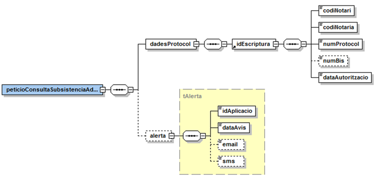
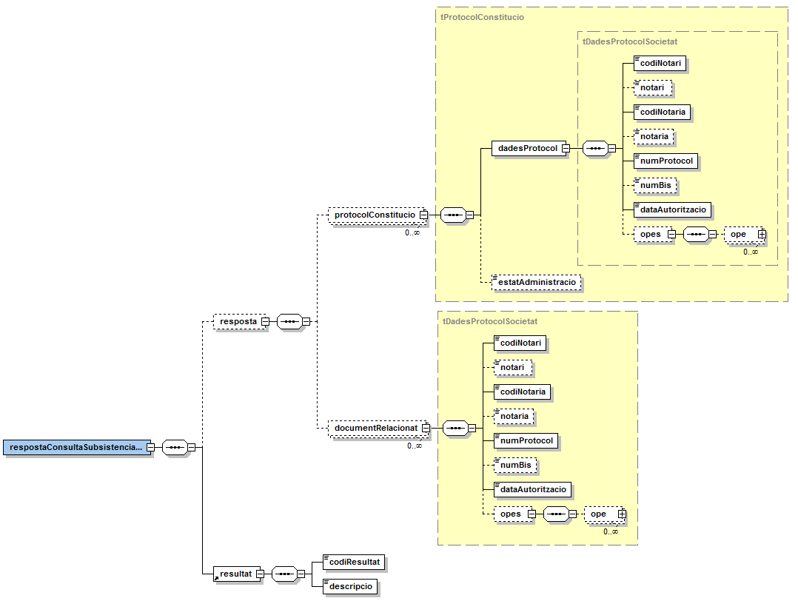
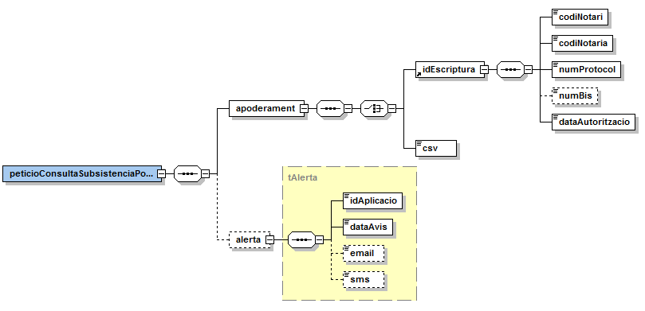
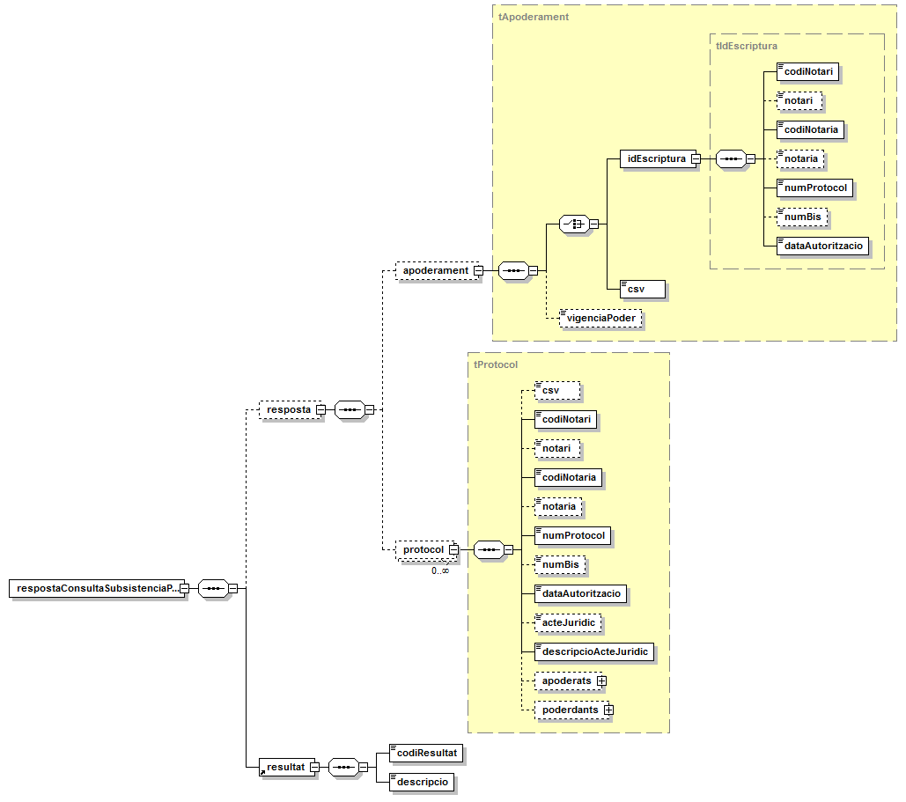
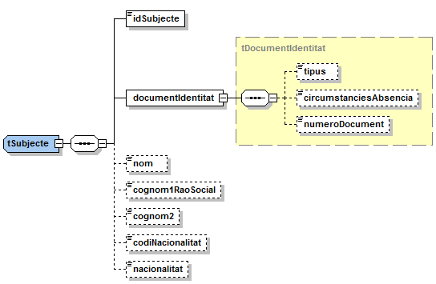
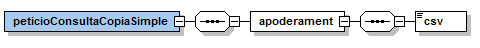
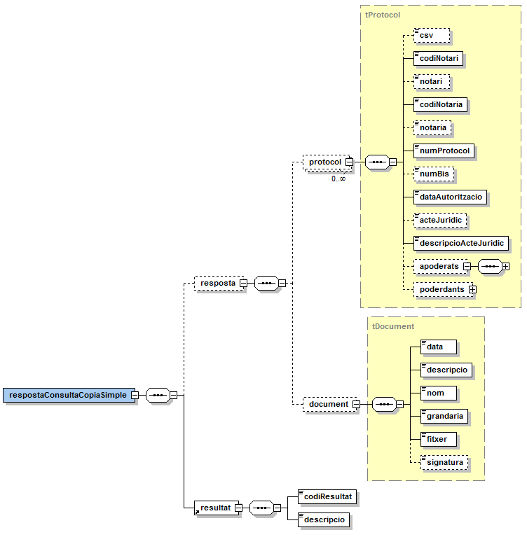
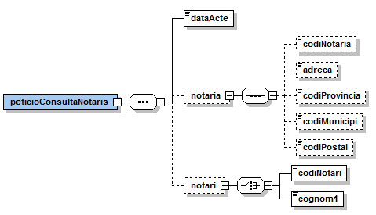
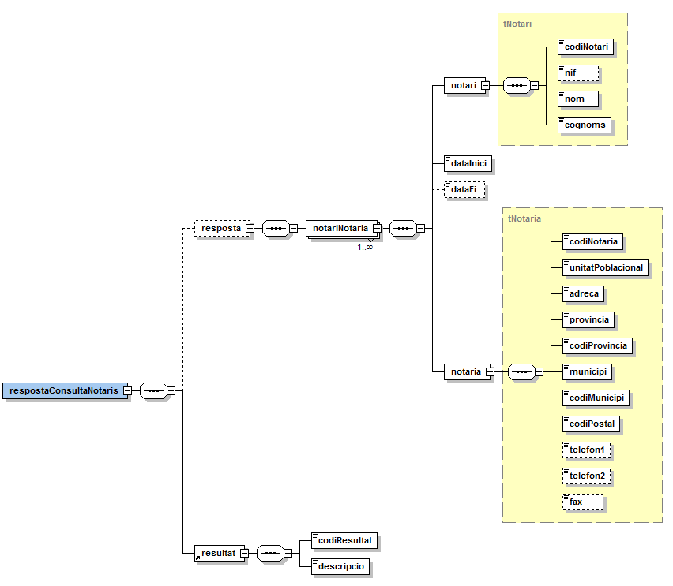

# VO-NOTARIS Document d&#39;integració del servei

## **Via Oberta – Poders Notarials**

**Històric de revisions**

| **Versió** | **Data** | **Autor** | **Comentaris** |
| --- | --- | --- | --- |
| V1.0 | 17/07/2018 | Roger Noguera i Arnau | Creació del document |

# 1 Introducció

Aquest document detalla la missatgeria associada al servei de consulta d&#39;informació del Registre Electrònic de Poders Notarials.

Per poder realitzar la integració cal conèixer prèviament la següent documentació:

- [Document de Missatgeria Genèrica de la PCI del Consorci AOC.][PCI]

[PCI]:https://github.com/ConsorciAOC/PCI

# 2 Transmissions de dades disponibles

Les dades disponibles a través del servei són les que es presenten a continuació:

| **EMISSOR** |
| --- |
| Consejo General del Notariado via MINHAP |

| **PRODUCTE** | **MODALITAT** | **DESCRIPCIO** |
| --- | --- | --- |
| **PODERS\_NOTARIALS** | SUBSISTENCIA\_ADMINISTRADORS | Consulta de subsistència d&#39;administradors d&#39;una societat.|
| **PODERS\_NOTARIALS** | SUBSISTENCIA\_PODERS | Consulta de subsistència de poders notarials. |
| **PODERS\_NOTARIALS** | COPIA\_SIMPLE | Consulta de copies simples de poders notarials o documents que afectin a la subsistència d&#39;un poder notarial. |
| **PODERS\_NOTARIALS** |CONSULTA\_NOTARIS | Consulta de notaris i notaries. |

# 3 Missatgeria dels serveis

A continuació es detalla la missatgeria corresponent al bloc de dades específiques de les modalitats de consum del producte DGT.

## 3.1 Consulta de subsistència d&#39;administradors d&#39;una societat (SUBSISTENCIA\_ADMINISTRADORS)

### 3.1.1 Petició – dades específiques

| _Element_ | _Descripció_ |
| --- | --- |
| peticioConsultaSubsistenciaAdministradors/dadesProtocol/idEscriptura | Bloc de dades que conté les dades de l&#39;escriptura de nomenament de l&#39;administrador del qual es vol comprovar el seu estat de nomenament a la societat.|
| //idEscriptura/codiNotari | Codi identificador del notari. |
| //idEscriptura/codiNotaria | Codi identificador de la notaria. |
| //idEscriptura/numProtocol | Número de protocol de l&#39;escriptura. |
| //idEscriptura/numBis | Número bis del protocol. |
| //idEscriptura/dataAutoritzacio | Data d&#39;autorització de l&#39;escriptura (*AAAA-MM-DD*). |
| peticioConsultaSubsistenciaAdministradors/alerta | Dades de contacte de la persona que realitza la consulta de la subsistència, per tal de notificar-li, en cas que n&#39;hi hagin, modificacions que afectin a l&#39;escriptura de nomenament consultada. |
| //alerta/idAplicacio | Identificador de l&#39;aplicació que realitza la consulta (identificador únic per cada organisme requeridor)¹. |
| //alerta/dataAvis | Data fins la que es desitja rebre alertes si hi ha cap canvi. |
| //alerta/email | Correu electrònic on es desitja rebre alertes si hi ha cap canvi. |
| //alerta/sms | Número de mòbil on es desitja rebre alertes si hi ha cap canvi. |

¹ Per consultar el llistat d'alertes als que s'està subscrit, cal accedir al servei "Avísame" del MINHAP: https://avisame.redsara.es/gestorNotificaciones/services

### 3.1.2 Resposta – dades específiques

| _Element_ | _Descripció_ |
| --- | --- |
| respostaConsultaSubsistenciaAdministradors/resposta | Bloc de dades corresponent a la resposta a la consulta. |
| //resposta/protocolConstitucio | Bloc de dades que conté els protocols de constitució de les societats per les quals apareixen administradors en l&#39;escriptura de nomenament consultada.  L&#39;habitual és que l&#39;escriptura de nomenament sigui relativa a una única societat però hi ha casos en els que la mateixa escriptura de nomenament es nomenen càrrecs de més d&#39;una societat. |
| //resposta/protocolConstitucio/dadesProtocol | Dades identificatives del protocol de constitució d&#39;una societat. Vegeu apartat Protocol de societat3.1.2.1. |
| //resposta/protocolConstitucio/estatAdministracio |<li> NO\_CANVIS\_POSTERIORS<li> CANVIS\_POSTERIORS |
| //resposta/documentRelacionat | Bloc de dades que conté els documents de cessament, renúncia o nou atorgament posteriors al consultat, relacionats amb l&#39;escriptura de constitució del mateix. Vegeu apartat Protocol de societat3.1.2.1. |
| respostaConsultaSubsistenciaAdministradors/resultat/codiResultat | Codi de resultat de la consulta:<li>0003: existeixen dades d&#39;administradors per un poder notarial.<li> 0227: existeixen dades d&#39;administradors per un poder notarial però no s&#39;ha pogut donar d&#39;alta la subscripció d&#39;alerta.<li> 5: protocol sense dades complertes relatives a l&#39;administració de la societat. L&#39;escriptura consultada correspon a una societat per la que el seu document de constitució ha estat signat amb anterioritat a la de recollida de la informació en l&#39;índex, la qual cosa impossibilita donar informació complerta de l&#39;estat de l&#39;administració de la societat.<li> 7: protocol no relatiu a una escriptura de nomenament. L&#39;escriptura consultada té un número de protocol vàlid però no conté cap acte jurídic de nomenament de càrrec.<li>0502: error realitzant la consulta. |
| respostaConsultaSubsistenciaAdministradors/resultat/descripcio | Descripció del resultat. |

#### 3.1.2.1 Protocol de societat

| _Element_ | _Descripció_ |
| --- | --- |
| //codiNotari | Codi identificador del notari. |
| //notari | Dades del notari (NIF i nom i cognoms del notari). |
| //codiNotaria | Codi identificador de la notaria. |
| //notaria | Adreça de la notaria. |
| //numProtocol | Número de protocol de l&#39;escriptura. |
| //numBis | Número bis del protocol. |
| //dataAutoritzacio | Data d&#39;autorització de l&#39;escriptura (AAAA-MM-DD). |
| //opes/ope | Dades sobre les operacions realitzades a la societat. |
| //ope/acteJuridic | Acte jurídic segons el Índice Único Informatizado del Consejo General del Notariado. |
| //ope/descripcioActeJuridic | Descripció de l&#39;acte jurídic. |
| //ope/administradors/administrador | Bloc que conté dades d&#39;un dministrador de la societat. |
| //administrador/nif | Identificador fiscal de l&#39;administrador. |
| //administrador/nom | Nom de l&#39;administrador. |
| //administrador/cognom1 | Primer cognom de l&#39;administrador identificat per NIF o raó social en cas d&#39;identificat per CIF. |
| //administrador/cognom2 | Segon cognom de l&#39;administrador. |
| //administrador/tipusAdministracio | Descripció del tipus d&#39;administrador. |
| //societat/cif | CIF de la societat. |
| //societat/raoSocial | Raó social de la societat. |

#### 3.1.2.2 Descripció d&#39;actes jurídics relatius a entitats amb personalitats jurídiques

| _Codi acte_ | _Descripció_ |
| --- | --- |
| 1901 | CONSTITUCIÓN DE SOCIEDAD CIVIL |
| 1902 | CONSTITUCIÓN DE SOCIEDAD AGRARIA DE TRANSFORMACIÓN 1903 CONSTITUCIÓN DE AGRUPACIÓN DE INTERÉS URBANÍSTICO, JUNTA DE COMPENSACIÓN O DE CUALQUIER OTRA ENTIDAD PARA UNA ACTUACIÓN URBANÍSTICA EN CURSO |
| 1904 | AGRUPACIÓN DE INTERÉS ECONÓMICO 1905 ENTIDAD URBANÍSTICA COLABORADORA |
| 1906 | CONSTITUCIÓN DE PARTIDO POLÍTICO 1907 CONSTITUCIÓN DE SINDICATO |
| 1908 | CONSTITUCIÓN DE ASOCIACIÓN 1909 CONSTITUCIÓN DE ASOCIACIÓN PATRONAL |
| 1910 | CONSTITUCIÓN DE FUNDACIÓN 1911 CONSTITUCIÓN DE OTRO TIPO DE ENTIDADES NO MERCANTILES |
| 1912 | CONSTITUCIÓN DE SOCIEDAD LIMITADA 1913 CONSTITUCIÓN DE SOCIEDAD LIMITADA LABORAL |
| 1914 | CONSTITUCIÓN DE SOCIEDAD ANÓNIMA 1915 CONSTITUCIÓN DE SOCIEDAD ANÓNIMA LABORAL |
| 1916 | CONSTITUCIÓN DE SOCIEDAD ANÓNIMA DEPORTIVA 1917 CONSTITUCIÓN DE SOCIEDAD LIMITADA NUEVA EMPRESA |
| 1918 | CONSTITUCIÓN DE SOCIEDAD ANÓNIMA NUEVA EMPRESA 1919 CONSTITUCIÓN DE SOCIEDAD DE INVERSIÓN MOBILIARIA DE CAPITAL FIJO |
| 1920 | CONSTITUCIÓN DE INVERSIÓN MOBILIARIA DE CAPITAL VARIABLE 1921 CONSTITUCIÓN DE SOCIEDAD COMANDITARIA POR ACCIONES |
| 1922 | CONSTITUCIÓN DE SOCIEDAD DE GARANTÍA RECIPROCA 1923 CONSTITUCIÓN DE SOCIEDAD REGULAR COLECTIVA |
| 1924 | CONSTITUCIÓN DE SOCIEDAD COMANDITARIA 1925 CONSTITUCIÓN DE COOPERATIVA |
| 1926 | CONSTITUCIÓN DE MUTUA 1927 CONSTITUCIÓN DE MUTUALIDAD |
| 1928 | CONSTITUCIÓN DE FONDO DE PENSIONES 1929 CONSTITUCIÓN DE FONDO DE INVERSIÓN MOBILIARIA |
| 1930 | CONSTITUCIÓN DE FONDO DE INVERSIÓN EN ACTIVOS DEL MERCADO MONETARIO 1931 CONSTITUCIÓN DE OTRAS INSTITUCIONES DE INVERSIÓN COLECTIVA |
| 1932 | AGRUPACIÓN EUROPEA DE INTERÉS ECONÓMICO 1933 LA SOCIEDAD ANÓNIMA EUROPEA |
| 1934 | LOS PLANES DE PENSIONES 1935 LOS FONDOS DE INVERSIÓN O TITULACIÓN INMOBILIARIA |
| 1936 | AMPLIACIÓN DE CAPITAL CON SUSCRIPCIÓN 1937 DESEMBOLSO DE DIVIDENDOS PASIVOS |
| 1938 | APORTACIÓN DE BIENES A SOCIEDAD EN CONSTITUCIÓN O AUMENTO DE CAPITAL |
| 1939 | DETERMINACIÓN DE SUSCRIPTORES |
| 1940 | REDUCCIÓN DE CAPITAL CON AMORTIZACIÓN DE ACCIONES/PARTICIPACIONES 1941 DISOLUCIÓN DE SOCIEDAD MERCANTIL |
| 1942 | DISOLUCIÓN DE SOCIEDAD POR CESIÓN GLOBAL DE ACTIVO Y PASIVO 1943 CESIÓN GLOBAL DE ACTIVO Y PASIVO EN CASO DE DISOLUCIÓN |
| 1944 | DISOLUCIÓN Y EXTINCIÓN DE ENTIDADES NO MERCANTILES 1945 ADJUDICACIÓN DE BIENES A LOS SOCIOS EN LIQUIDACIÓN O REDUCCIÓN DE CAPITAL EN SOCIEDAD |
| 1946 | TRANSFORMACIÓN EN SOCIEDAD LIMITADA 1947 TRANSFORMACIÓN EN SOCIEDAD ANÓNIMA |
| 1948 | TRANSFORMACIÓN EN OTRO TIPO DE SOCIEDADES 1949 DISOLUCIÓN DE SOCIEDAD POR FUSIÓN |
| 1950 | CONSTITUCIÓN DE SOCIEDAD POR FUSIÓN 1951 AUMENTO DE CAPITAL POR FUSIÓN CON SUSCRIPCIÓN |
| 1952 | APORTACIÓN DE BIENES COMO CONSECUENCIA DE FUSIÓN 1953 DISOLUCIÓN DE SOCIEDAD POR ESCISIÓN TOTAL |
| 1954 | REDUCCIÓN DE CAPITAL POR ESCISIÓN PARCIAL CON DEVOLUCIÓN DE APORTACIONES 1955 CONSTITUCIÓN DE SOCIEDAD POR ESCISIÓN TOTAL O PARCIAL |
| 1956 | AUMENTO DE CAPITAL POR ESCISIÓN CON SUSCRIPCIÓN 1957 APORTACIONES DE BIENES COMO CONSECUENCIA DE LA ESCISIÓN |
| 1958 | CONSTITUCIÓN DE ESTABLECIMIENTO MERCANTIL 1959 TRASLADO Y MODIFICACIÓN DE DOMICILIO SOCIAL |
| 1960 | CAMBIO DE DENOMINACIÓN 1961 OTRAS MODIFICACIONES DE ESTATUTOS O DE REGULACIÓN DE PERSONA JURÍDICA |
| 1962 | ADAPTACIÓN DE ESTATUTOS SOCIALES 1963 REDENOMINACIÓN DE CAPITAL O CONVERSIÓN DE ACCIONES |
| 1964 | CAMBIO DE SOCIO ÚNICO DE ENTIDAD UNIPERSONAL 1965 DECLARACIÓN DE UNIPERSONALIDAD |
| 1966 | CESE DE LA UNIPERSONALIDAD 1967 SEPARACIÓN O EXCLUSIÓN DE SOCIO |
| 1968 | REACTIVACIÓN DE SOCIEDADES 1969 OTROS SUPUESTOS DE ACTOS RELATIVOS A ENTIDADES JURÍDICAS |
| 1971 | LIQUIDACIÓN Y EXTINCIÓN DE SOCIEDAD 1972 REPARTO DE ACTIVO SOBREVENIDO DE SOCIEDAD EXTINGUIDA |
| 1973 | NOMBRAMIENTO DE MIEMBRO DEL ÓRGANO DE ADMINISTRACIÓN, CONSEJERO DELEGADO Y LIQUIDADOR 1974 NOMBRAMIENTO DE AUDITOR |
| 1975 | NOMBRAMIENTO CARGOS DE LOS RESTANTES TIPOS DE PERSONAS JURÍDICAS 1976 CESE DE ADMINISTRADOR Y OTROS CARGOS |
| 1977 | ACEPTACIÓN DEL CARGO DE ADMINISTRADOR AUDITOR U OTROS EN ESCRITURA SEPARADA 1978 RENUNCIA DEL ADMINISTRADOR Y OTROS CARGOS |
| 1979 | EMISIÓN DE OBLIGACIONES Y OTROS ACTIVOS FINANCIEROS 1980 AUMENTO DE DOTACIÓN DE FUNDACIÓN |
| 1981 | AUMENTO DE CAPITAL SIN SUSCRIPCIÓN |
| 1982 | AUMENTO DE CAPITAL POR ESCISIÓN SIN SUSCRIPCIÓN |
| 1983 | REDUCCIÓN DE CAPITAL SIN AMORTIZACIÓN DE ACCIONES/PARTICIPACIONES |
| 1984 | REDUCCIÓN DE CAPITAL POR ESCISIÓN PARCIAL SIN DEVOLUCIÓN DE APORTACIONES |
| 1985 | CONSTITUCIÓN DE ESTABLECIMIENTO DE ENTIDAD NO MERCANTIL |
| 1986 | APORTACIÓN A PATRIMONIO SOCIAL |
| 1987 | LIQUIDACIÓN Y EXTINCIÓN DE SOCIEDAD SIN IDENTIFICACIÓN DE LOS SOCIOS |

## 3.2 Consulta de subsistència de poders notarials (SUBSISTENCIA\_PODERS)

### 3.2.1 Petició – dades específiques

| _Element_ | _Descripció_ |
| --- | --- |
| peticioConsultaSubsistenciaPoders/apoderament/idEscriptura | Bloc de dades que conté les dades de l&#39;escriptura d&#39;apoderament. |
| //idEscriptura/codiNotari | Codi identificador del notari. |
| //idEscriptura/codiNotaria | Codi identificador de la notaria. |
| //idEscriptura/numProtocol | Número de protocol de l&#39;escriptura. |
| //idEscriptura/numBis | Número bis del protocol. |
| //idEscriptura/dataAutoritzacio | Data d&#39;autorització de l&#39;escriptura (*AAAA-MM-DD*). |
| peticioConsultaSubsistenciaPoders/apoderament/csv | Codi de verificació segur de l&#39;escriptura d&#39;apoderament. |
| peticioConsultaSubsistenciaPoders/alerta | Dades de contacte de la persona que realitza la consulta de la subsistència, per tal de notificar-li, en cas que n&#39;hi hagin, modificacions que afectin al poder consultat. |
| //alerta/idAplicacio | Identificador de l&#39;aplicació que realitza la consulta (identificador únic per cada organisme requeridor). |
| //alerta/dataAvis | Data fins la que es desitja rebre alertes si hi ha cap canvi. |
| //alerta/email | Correu electrònic on es desitja rebre alertes si hi ha cap canvi. |
| //alerta/sms | Número de mòbil on es desitja rebre alertes si hi ha cap canvi. |

---
 En el Índice Único Informatizado únicament es troben disponibles els poders autoritzats amb data posterior a l&#39;1 de Gener del 2004 i les revocacions autoritzades amb data posterior a l&#39;1 d&#39;Octubre del 2010.

---

###

### 3.2.2 Resposta – dades específiques

| _Element_ | _Descripció_ |
| --- | --- |
| respostaConsultaSubsistenciaPoders/resposta
 | Bloc de dades corresponent a la resposta a la consulta. |
| //resposta/apoderament/idEscriptura
 | Dades de l&#39;escriptura d&#39;apoderament. |
| //idEscriptura/codiNotari | Codi identificador del notari. |
| //idEscriptura/notari | Dades del notari (NIF i nom i cognoms del notari). |
| //idEscriptura/codiNotaria | Codi identificador de la notaria. |
| //idEscriptura/notaria | Adreça de la notaria. |
| //idEscriptura/numProtocol | Número de protocol de l&#39;escriptura. |
| //idEscriptura/numBis | Número bis del protocol. |
| //idEscriptura/dataAutoritzacio | Data d&#39;autorització de l&#39;escriptura (*AAAA-MM-DD*). |
| //resposta/apoderament/csv | Codi de verificació segur de l&#39;escriptura d&#39;apoderament. |
| //resposta/apoderament/vigenciaPoder | Vigència del poder:<li>1: subsistent<li> 2: parcialment revocat<li>3: totalment revocat |
| //resposta/protocol | Bloc de dades del protocol. Vegeu apartat 3.2.2.1. |
| //protocol/csv | Codi segur de verificació. |
| //protocol/codiNotari | Codi identificador del notari. |
| //protocol/notari | Dades del notari (NIF i nom i cognoms del notari). |
| //protocol/codiNotaria | Codi identificador de la notaria. |
| //protocol/notaria | Adreça de la notaria. |
| //protocol/numProtocol | Número de protocol de l&#39;escriptura. |
| //protocol/numBis | Número bis del protocol. |
| //protocol/dataAutoritzacio | Data d&#39;autorització de l&#39;escriptura (*AAAA-MM-DD*). |
| //protocol/acteJuridic | Acte jurídic segons el Índice Único Informatizado del Consejo General del Notariado. |
| //protocol/descripcioActeJuridic | Descripció de l&#39;acte jurídic. |
| //protocol/apoderats/apoderats | Bloc de dades amb dades d&#39;apoderats. Vegeu apartat 3.2.2.2.. |
| //protocol/poderdants/poderdant | Bloc de dades amb dades de poderdants. Vegeu apartat 3.2.2.2. |
| respostaConsultaSubsistenciaPoders/resultat/codiResultat | Codi de resultat de la consulta:<li> 0003: existeix el poder notarial.<li> 0227: existeix el poder notarial però no s&#39;ha pogut donar d&#39;alta la subscripció d&#39;alerta.<li> 10: no existeix cap poder notarial amb les dades indicades.<li> 11: el poder notarial consultat correspon a una escriptura d&#39;atorgament de poder però no es pot consultar la subsistència del mateix degut a l&#39;antiguitat del document.  Així, s&#39;ha consultat un poder amb data d&#39;autorització compresa entre l&#39;1 de Gener de 2004 i l&#39;1 d&#39;Octubre de 2010, pel qual no es té enregistrada cap revocació i per tant només es pot indicar que es tracta d&#39;una escriptura d&#39;atorgament del poder però no la subsistència del mateix.<li> 0502: error realitzant la consulta. |
| respostaConsultaSubsistenciaPoders/resultat/descripcio | Descripció del resultat. |

#### 3.2.2.1 Dades del protocol

| _Element_ | _Descripció_ |
| --- | --- |
| //protocol/csv | Codi segur de verificació. |
| //protocol/codiNotari | Codi identificador del notari. |
| //protocol/notari | Dades del notari (NIF i nom i cognoms del notari). |
| //protocol/codiNotaria | Codi identificador de la notaria. |
| //protocol/notaria | Adreça de la notaria. |
| //protocol/numProtocol | Número de protocol de l&#39;escriptura. |
| //protocol/numBis | Número bis del protocol. |
| //protocol/dataAutoritzacio | Data d&#39;autorització de l&#39;escriptura (*AAAA-MM-DD*). |
| //protocol/acteJuridic | Acte jurídic segons el Índice Único Informatizado del Consejo General del Notariado. |
| //protocol/descripcioActeJuridic | Descripció de l&#39;acte jurídic. |
| //protocol/apoderats/apoderats | Bloc de dades amb dades d&#39;apoderats. Vegeu apartat 3.2.2.1. |
| //protocol/poderdants/poderdant | Bloc de dades amb dades de poderdants. Vegeu apartat 3.2.2.1 |

#### 3.2.2.2 Dades del subjecte

| _Element_ | _Descripció_ |
| --- | --- |
| //idSubjecte | Identificador intern del subjecte. |
 | //documentIdentitat/tipus | <li> 1: NIF / CIF<li> 2: NIE<li> 3: Passaport<li> 4: Menors d&#39;edat sense documentació<li> 5: Entitat recent constituïda sense NIF<li> 6: Manca d&#39;aportació del NIF o NIF aportat però no vàlid<li> 7: Cònjuge co-titular que no intervé<li> 8: Document d&#39;identificació d&#39;estranger<li> 9: Document de persona jurídica estrangera<li> 10: Manca d&#39;aportació de NIF o NIE<li> 11: Manca d&#39;aportació de NIF<li>12: Targeta de residència<li>15: Document d&#39;identificació diferent o absència de document |
| //documentIdentitat | Número del document d&#39;identitat. |
| /circumstanciesAbsencia | Circumstàncies concretes concurrents de l&#39;absència del document d&#39;identitat. |
| //documentIdentitat/numeroDocument | Número del document d&#39;identitat. |
| //nom | Nom. |
| //cognom1RaoSocial | Primer cognom o raó social. |
| //cognom2 | Segon cognom. |
| //codiNacionalitat | Codi de país segons la codificació oficial de Països i Territoris aprovada per la OM 9-12-99. |
| //nacionalitat | Nacionalitat. |

#### 3.2.2.3 Descripció d&#39;actes jurídics relatius a apoderaments

| _Codi acte_ | _Descripció_ |
| --- | --- |
| 1401 | Poder general |
| 1402 | Poder electoral |
| 1403 | Poder para pleitos |
| 1404 | Sustitución de poder para pleitos |
| 1405 | Otro tipo de apoderamientos |
| 1406 | Revocación de apoderamiento o autorización |
| 1407 | Autorizaciones |
| 1408 | Renuncia del apoderado |
| 1409 | Escritura de ratificación o aceptación |
| 1410 | Poder preventivo para el caso de incapacidad |
| 1411 | Sustitución de otros poderes |
| 1412 | Aceptación de cargos no societarios |
| 1413 | Revocación de poder para pleitos |
| 1414 | Poder general mercantil |
| 1415 | Poder de representación tributaria |

## 3.3 Consulta de subsistència de còpia simple de poder notarial (COPIA\_SIMPLE)

### 3.3.1 Petició – dades específiques

| _Element_ | _Descripció_ |
| --- | --- |
| peticioConsultaCopiaSimple/apoderament/csv | CSV del poder notarial. |

### 3.3.2 Resposta – dades específiques

| _Element_ | _Descripció_ |
| --- | --- |
| respostaConsultaCopiaSimple/resposta
 | Bloc de dades corresponent a la resposta a la consulta. |
| //resposta/protocol | Bloc de dades del protocol. Vegeu apartat 3.2.2.1. |
| //resposta/document | Bloc de dades que conté la informació de l&#39;escriptura digitalitzada. |
| //document/data | Data del document (AAAA-MM-DD). |
| //document/descripcio | Descripció lliure del document. |
| //document/nom | Nom del document original. |
| //document/grandaria | Grandària del document (Kb). |
| //document/fitxer | Document PDF en Base64. |
| //document/signatura | Signatura PKCS7 del document en Base64. |
| respostaConsultaCopiaSimple/resultat/codiResultat | Codi de resultat de la consulta:<li> 0003: existeix el CSV indicat.<li> 11: error tècnic (inconsistència de dades al determinar la vigència).<li> 12: el CSV indicat no correspon a cap còpia.<li> 0502: error realitzant la consulta. |
| respostaConsultaCopiaSimple/resultat/descripcio | Descripció del resultat. |

## 3.4 Consulta de notaris i notaries (CONSULTA\_NOTARIS)

### 3.4.1 Petició – dades específiques

| _Element_ | _Descripció_ |
| --- | --- |
| peticioConsultaNotaris/dataActe | Data aproximada de consulta en la que el notari consultat va exercir les seves funcions. |
| peticioConsultaNotaris/notaria/codiNotaria | Codi de cadastre que identifica la notaria. |
| peticioConsultaNotaris/notaria/adreca | Adreça de la notaria. |
| peticioConsultaNotaris/notaria/codiProvincia | Codi INE de la província de la notaria. |
| peticioConsultaNotaris/notaria/codiMunicipi | Codi INE del municipi de la notaria. |
| peticioConsultaNotaris/notaria/codiPostal | Codi postal de la notaria. |
| peticioConsultaNotaris/notari/codiNotari | Codi identificatiu del notari. |
| peticioConsultaNotaris/notari/cognom1 | Primer cognom del notari. |

### 3.4.2 Resposta – dades específiques

| _Element_ | _Descripció_ |
| --- | --- |
| respostaConsultaNotaris/notariNotaria
 | Bloc de dades corresponent a les dades d&#39;un notari. |
| //notariNotaria/notari/codiNotari | Codi identificatiu del notari. |
| //notariNotaria/notari/nif | Documentació del notari. |
| //notariNotaria/notari/nom | Nom del notari. |
| //notariNotaria/notari/cognoms | Cognoms del notari. |
| //notariNotaria/dataInici | Data d&#39;inici en la que el notari va començar a exercir les seves funcions a la notaria especificada (*AAAA-MM-DD*). |
| //notariNotaria/dataFi | Darrera data en la que el notari va exercir les seves funcions a la notaria especificada (*AAAA-MM-DD*). |
| //notariNotari/notaria/codiNotaria | Codi de cadastre que identifica la notaria. |
| //notariNotari/notaria/unitatPoblacional | Descripció literal de la població o lloc on es troba la notaria. |
| //notariNotari/notaria/adreca | Adreça. |
| //notariNotari/notaria/provincia | Nom de la província. |
| //notariNotari/notaria/codiProvincia | Codi INE de la província. |
| //notariNotari/notaria/municipi | Municipi. |
| //notariNotari/notaria/codiMunicipi | Codi INE del municipi. |
| //notariNotari/notaria/codiPostal | Codi postal. |
| //notariNotari/notaria/telefon1 | Telèfon de contacte principal. |
| //notariNotari/notaria/telefon2 | Telèfon de contacte secundari. |
| //notariNotari/notaria/fax | FAX. |

